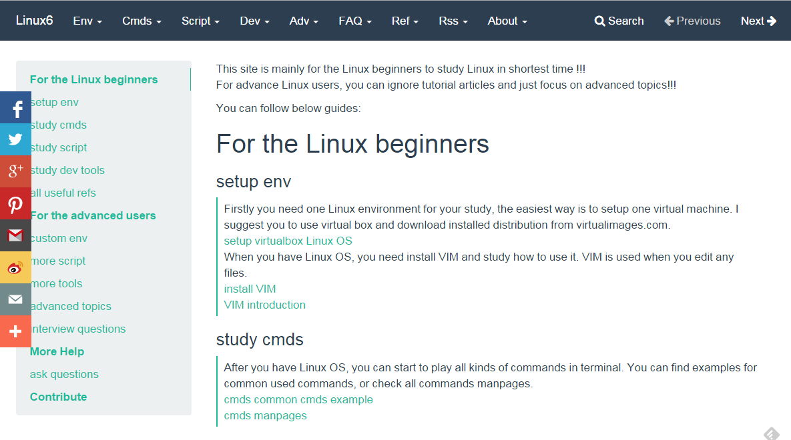

linux6
======

This site [www.linux6.com](http://www.linux6.com) is for linux beginners and advanced users, which is generated by [mkdocs](http://www.mkdocs.org) and hosted in [github pages](https://github.com/itech001/linux6).  

Welcome everyone to contribute any other articles and suggestions by pull requests.  

  

##contribute steps:
1. make sure you have python installed
1. install mkdocs dependences: pip install mkdocs && pip uninstall mkdocs
1. get code: git clone https://github.com/itech001/linux6.git(or your forked repo)
1. sync to latest: git pull
1. initial env: source env/setup.sh
1. add md or html files under src/docs/
1. edit mkdocs.yml as need to add meau items
1. build by: mkdocs build
1. preview by: mkdocs serve, and open localhost:8000 in browser
1. git commit and git push 
1. deploy by: mkdocs gh-deploy 

##Author
itech001@126.com 
