#  Git Tutorial

Modified from [git tutorals](http://www.ralfebert.de/tutorials/git/)

###  Git installation on Linux

Linux distributions provide packages for `git`, for example Ubuntu 10.10 comes
with git 1.7.1:

> sudo apt-get install git  
  git --version  
  git version 1.7.1  

###  Creating a new repository

`git init` creates an empty git repository in the current folder:

> git init

This might surprise readers who are accustomed to traditional version control
systems like CVS or SVN. A git repository can be a completely local
undertaking. The whole `repository` content is stored in a folder named `.git`
in the root of the project folder:  
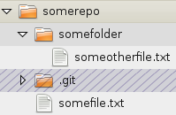  
Of course git can also work with remote or central repositories, but it does
not require them. We will have a look at working with remote repositories in a
forthcoming part of the tutorial. For the moment let us enjoy the freedom of
creating a repository locally whenever and for whatever reason we may need
one!

###  The working tree

Your own files in the repository folder are called `working tree`:  
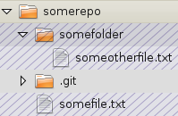  

###  The staging index

Git internally holds a thing called the `index`, which is a snapshot of your
project files. After you have just created an empty repository, the index will
be empty. You must manually stage the files from your `working tree` to the
`index` using `git add`:

> git add somefile.txt

`git add` works recursively, so you can also add whole folders:

> git add somefolder

The same applies if you change a file in your working tree - you have to add
this change to the index with `git add`:

> edit somefile.txt  
  git add somefile.txt

  

It’s important to realize that the index is a full snapshot of your project
files - it is not just a list of the changed files.

##  Committing

`git commit` takes the contents of the index and creates a new `commit`:

> git commit -m "the 1st commit"

Committing is a completely local operation, not related to sending something
to a remote server. It just takes the contents of the index and keeps a
snapshot of your project files as they were in the index:  

  

Similiar to the index a `commit` is a full snapshot of your project files.
Different from traditional version control systems, commits are not numbered.
Instead, a `commit` gets assigned a SHA-1 hash of the snapshot contents:  
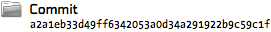  

This may look awkward the first time you see it. But it brings a huge
advantage with it: every commit, which is a full snapshot of your project
files, is identified by a cryptographically tamper-proof signature of your
file contents. If somehow one byte of the contents or history of your files
changes, you would end up with an entirely different hash. So you’re
guaranteed to get out what you put into a git repository.

Also, you don’t need to write the full commit hash when you want to refer to
some specific commit - you can always abbreviate them by their first
characters. The first seven characters are usually enough to identify one
commit uniquely.

###  Commit history

The workflow for editing files in a git repository looks like this:

> You make changes to the `working tree` files.
 You add these changes to the `index` using `git add`.
 You create a new commit from the `index` using `git commit`.

As you do this repeatedly, you will create a new `commit` each time, pointing
back to the previous commit:  
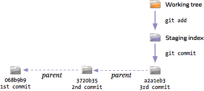  

This is how git keeps track of the project history. It stores snapshots of the
project files as `commits`. These commits point back to the commit they were
created from. Of course, all these snapshots are saved in a very efficient
manner occupying only a fraction of disk space compared to a full copy of all
your files.

You can see the history using `git log`:

> git log  
   commit 068b9b9...  
   Author: Bob <bob@example.com>  
   Date:   Wed Jun 17 17:21:16 2009 +0200  
   the 3rd commit  
   commit 3720b35...  
   Author: Bob <bob@example.com>  
   Date:   Wed Jun 17 17:21:10 2009 +0200  
   the 2nd commit  
   commit a2a1eb3...  
   Author: Bob <bob@example.com>  
   Date:   Wed Jun 17 17:21:10 2009 +0200  
   the 1st commit

git can also show a shorter version of the history using:

> git log --pretty=oneline --abbrev-commit  
   068b9b9 the 3rd commit  
   3720b35 the 2nd commit  
   a2a1eb3 the 1st commit  

###  Git configuration: user settings

If you look at the full commit messages above, you will see that they contain
information about their author. Where does git take this information from when
it created the commit? Initially, it tries to guess these from your username
and hostname. You can also configure them for your project manually:

> git config user.name "Bob"  
  git config user.email "bob@example.com"

You can also configure this globally for all your git projects:

> git config --global user.name "Bob"  
  git config --global user.email "bob@example.com"

###  Seeing what will be committed

`git status` shows you how the `working tree` is different from the `index`
and how the `index` is different from the last `commit`:

> git status

At first, you will see the changes that were already added to the `index`.
This list represents what will be in your next commit:

> Changes to be committed:  
  modified:   changed_file_added.txt

Also, git will show the changes that have been made to the working tree, but
were not yet added to the `index`:

> Changed but not updated:  
  modified:   changed_file.txt  
  untracked files:  
  newfile.txt  

###  Shortcut: How to add changed files when committing

When committing, you can leave the task of adding the changed files to git
using the `-a` command line option:

> git commit -a -m "commit message"

This will add all changed (but not new) files to the index before committing.

###  Throwing changes away

What if you made some changes to your project and want to return to the
original state? This depends on where the changes are.

If you have not added them to the `index` yet, you can restore them from the
`index` using `git checkout <filename>`:

> git checkout somefile.txt

This restores a file or a folder as it is stored in the `index` to your
`working tree`:  

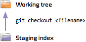  

What if you have already added the changes to the `index`? You can restore the
`index` to the last commit using `git reset`:

> git reset HEAD somefile.txt

You can also restore the whole `index`:

> git reset HEAD

`HEAD` always refers to the last commit which has been made. Using this, the
`index` is restored to the contents of the last commit - you can then use `git
checkout` to restore your working tree as well:  
  

###  Reverting commits

If you have already committed your changes, you can make use of git’s built-in
“undo” command called `git revert <commit>`:

> git revert 068b9b9

This will create a second commit which undoes the changes of the given commit:

>  8b54ea7 Revert "the 3rd commit"  
   068b9b9 the 3rd commit  
   3720b35 the 2nd commit  
   a2a1eb3 the 1st commit  

Please note that you can also revert older commits:

> git revert 3720b35  
  git log --pretty=oneline --abbrev-commit
  ab621c7 Revert "the 2nd commit"
  068b9b9 the 3rd commit
  3720b35 the 2nd commit
  a2a1eb3 the 1st commit

However, reverting older commits can cause a conflict if the other commits
changed the same contents in the meantime. We will see how such conflicts are
resolved later on.

###  Seeing the diff between commits

To see the difference from one commit compared to its parent, use `git show
<commit>`:

> git show 3720b35

To compare two specific commits, use `git diff <commit_from>..<commit_to>`:

> git diff a2a1eb3..068b9b9

To see the diffs for the complete history, use `git log -p`

> git log -p

###  Configuring git: colored console output

Many commands like `git status` and `git diff` can show colored console
output, which helps reading their output. You can configure this globally
using:

> git config --global color.ui auto

###  Tagging commits

`git tag <name> <commit>` assigns a tag to a commit. If `<commit>` is omitted,
the last commit gets tagged:

> git tag working 3720b35  
  git tag broken

A tag is nothing more than a label that can be used to refer to the tagged
commit:  
  
Tags can be used everywhere where you can use the commit hash, for example in
`git diff`:

> git diff working..broken

Tags are perfect for labeling specific points in the history. It is very
common to label commits with the version number when you publish a release of
your project - this way you can find these important commits easily:

> git tag v1.0.3

###  Branches

So far we have seen how you can create commits and work with them. Up until
this point, all the history of our repository has been linear.

Let’s say we we want to develop a new feature for our project. This is
something very large and we want to keep those changes separate from other
changes. With branches, we can do that.

All the time, we were already working in a branch called `master`. This branch
was created automatically when we created the repository. You can see all
branches in the repository using `git branch`:

> git branch  
  master

So there is one branch called `master`. The asterisk denotes that this is the
branch we are working on. A branch can be compared, to some extent, with a
`tag`. At all times, a branch points to some commit, in our case to the latest
commit we made. You can prove that using:

> git branch -v  
  master 068b9b9 the 3rd commit

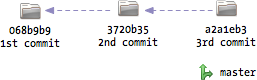  

To track changes in a separate branch, we have to create a new one using `git
branch <name> <commit>`. The specified commit will be the starting point for
the new branch - if you omit it, the latest commit will be used:

> git branch newfeature

This will create a new branch called `newfeature` based on the latest commit
in `master`:  
  

At all times, there is one specific active branch. If you call `git branch`,
you will see that a new branch named `newfeature` was created, but `master` is
still the active one:

> git branch  
  master  
  newfeature

You can switch between branches using `git checkout <branchname>`. This is the
same command we used before to get files from the staging index to the working
tree. The meaning of `git checkout` depends on its arguments.

> git checkout newfeature

Now the active branch in our repository is `newfeature`:

> git branch  
  master  
  newfeature  

We can start working in this branch using the already known commands `git
add`, `git commit`, etc. Let’s see what happens when we create a new commit in
the branch:

> edit somefile.txt  
  git commit -a -m "api draft"

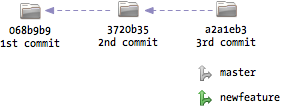  

The commit was added to the repository and the branch `newfeature` now points
to the new commit. Conceptually a branch can be seen as a pointer to some
commit. Whenever you commit something, this “pointer” of the active branch is
moved forward to the new commit. This is everything it takes to keep branches
separate.

To continue the example, let’s say we are finished with working on our new
feature for the moment and want to continue working on the master branch. That
is easy - we just switch back to the `master` branch:

> git checkout master

This will set the active branch back to `master`. It will also reset the
`index` and your `working tree` to the contents of the last commit in master:  

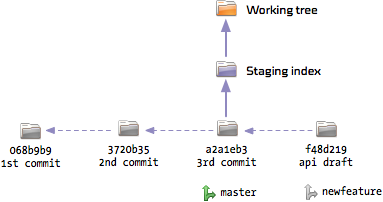  

So you will see the project in the exact same state it was in when we forked
off the new branch. There will be no trace of the changes of the `newfeature`
branch.

What happens if we add some changes and commit these?

> edit somefile.txt  
  git commit -a -m "bugfix"

The same as before: A new commit will be created based on the latest commit in
`master` and `master` will be pointing to the new commit after that:  

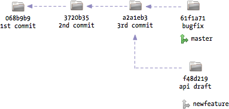  

Branches are very cheap and fast in git, you can create as many as you need.
Some developers like to work with a `stable` and an `unstable` branch whereas
some developers create a branch for every new feature they are working on -
it’s up to you.

###  Merging

Let’s say we have completed the new feature and want to get it back into the
`master` branch. This can be achieved with the `git merge` command whilst
having the master branch selected as the active branch:

> git merge newfeature

If all goes well there will be no conflicts and git will just create a new
commit containing the changes which have been made in both branches:  

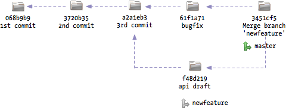  

Generally, git is very smart about merging. However, if the same contents were
changed in both branches, a conflict will arise:

> CONFLICT (content): Merge conflict in somefile.txt  
  Automatic merge failed; fix conflicts and then commit the result.

We have to resolve this conflict manually. If you have a look at the file with
the conflict, you will see the respective lines marked. On the top you will
see the version from the active branch, below you will see the version from
the merged branch:

>    <<<<<<< HEAD:somefile.txt  
    this change was done in master  
    =======  
    this change was done in newfeature  
    >>>>>>> newfeature:somefile.txt  

You have to resolve this conflict and remove the markers. After that you add
the file to the `index` and commit the result:

> git add somefile.txt  
  git commit

After you have merged the branch, you can delete it should you not need it
anymore:

> git branch -d newfeature

You could also continue working in the branch and later merge it again. git
will be smart enough to know that parts of the branch have been merged already
and will only apply the new changes.

###  Tools

Some versioning tasks can be performed in a simpler manner using GUI
applications. git comes with the history browser `gitk`:  

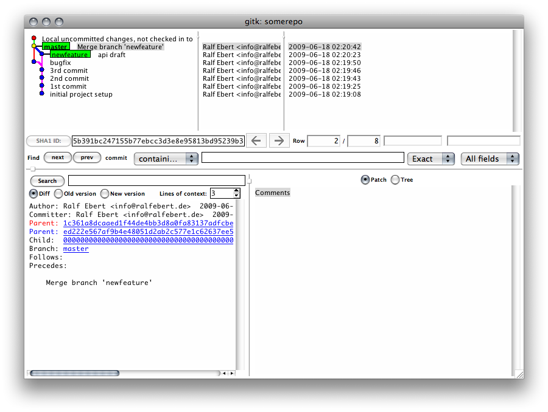  

For staging changes and committing you can use `git gui`:  

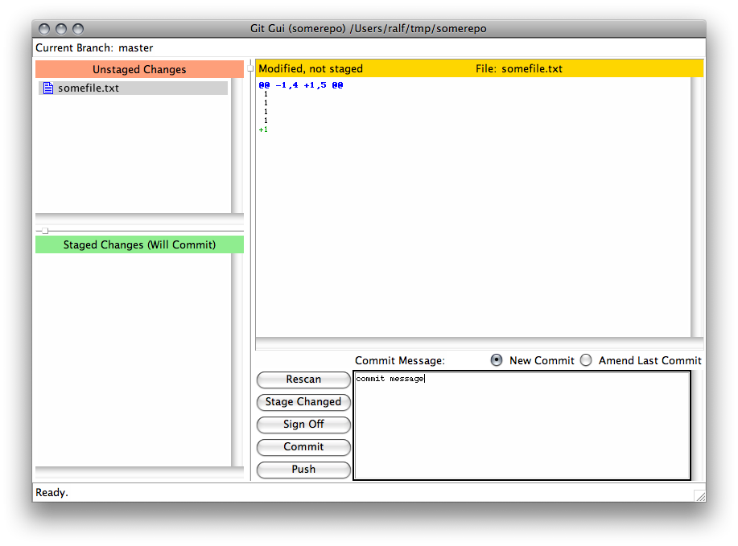  

These tools are not pretty, but they do their job very well. Mac OS X users
can use a nice alternative application for both tasks called  
[gitx](http://gitx.frim.nl/)  
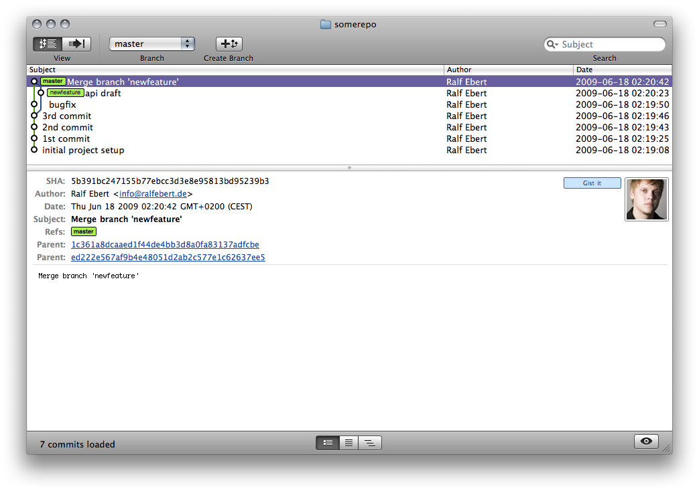  
